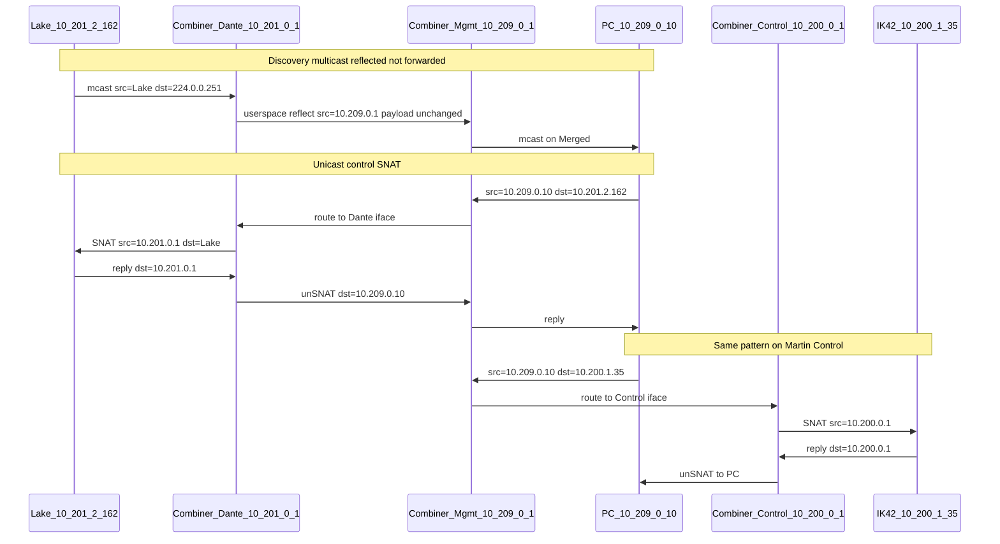

# Packet flow (production addressing)

How discovery and unicast control move through the combiner. Assumes a basic grasp of Linux forwarding, VLAN subinterfaces, and IPv4.

Related: [`architecture.md`](architecture.md) (why), [`traffic-matrix.md`](traffic-matrix.md) (allow/deny).

## Production address plan

Audio networks use **`/21`** (`255.255.248.0`). Merged Control is a new network; **`/24`** is enough for control clients.

| VLAN (role) | Prefix | Combiner IP | Example hosts |
| --- | --- | --- | --- |
| Merged Control (= Mgmt) | `10.209.0.0/24` | **`10.209.0.1`** | Control PC `10.209.0.10` |
| Martin Control | `10.200.0.0/21` (`10.200.0.0`–`10.200.7.255`) | **`10.200.0.1`** | IK42 #1 `10.200.1.35`, IK42 #2 `10.200.1.36` |
| Dante Primary | `10.201.0.0/21` (`10.201.0.0`–`10.201.7.255`) | **`10.201.0.1`** | Lake LM44 `10.201.2.162` |

If switch SVIs already own `.1` on Control/Dante, pick the next free addresses (e.g. `10.200.0.2` / `10.201.0.2`) and keep them out of any DHCP pool on those VLANs. The combiner must **not** run DHCP on Control or Dante.

VLAN **IDs** are site-specific (tagged on the trunk); see `config/site.example.yaml`.

```text
Merged Control 10.209.0.0/24              Martin Control 10.200.0.0/21
┌──────────────────────────────┐          ┌──────────────────────────────┐
│ PC 10.209.0.10               │          │ IK42 #1 10.200.1.35          │
│   VuNET + Dante Ctrl + Lake  │          │ IK42 #2 10.200.1.36          │
│ Combiner eth0.M 10.209.0.1   │◄─trunk──►│ Combiner eth0.C 10.200.0.1   │
└──────────────────────────────┘          └──────────────────────────────┘
                 │
                 │ same PHY, different 802.1Q tags
                 ▼
           Dante Primary 10.201.0.0/21
           ┌──────────────────────────────┐
           │ Lake LM44 10.201.2.162       │
           │ Combiner eth0.D 10.201.0.1   │
           └──────────────────────────────┘
```

On the Pi: one physical NIC, three VLAN subinterfaces, `ip_forward=1`, nftables table `inet combiner`, and the userspace **reflector** joined to allowlisted multicast groups.

**Critical split**

| Kind | Path | Transform |
| --- | --- | --- |
| Multicast discovery | **INPUT** on one VLAN → reflector → **OUTPUT** on the other | New UDP datagram; payload copied; headers rewritten |
| Unicast control | Kernel **FORWARD** + **SNAT** | Conntrack; src becomes combiner IP on egress VLAN |
| Control ↔ Dante | **Dropped** | No meeting point except the PC’s apps |
| PTP / media → Mgmt or Control | **Dropped** | Protects Martin amp control stacks |

Kernel `forward` **never** passes `224.0.0.0/4`. If multicast shows up in `drop_forward_mcast`, that is working as designed.

---

## Part 1 — Device discovery (multicast)

Dante-style discovery is the concrete example (mDNS `224.0.0.251:5353` and/or Dante control `224.0.0.230–233:8700–8708`). VuNET and Lake use the same *shape* once their groups are allowlisted; only addresses/ports change (fill from capture).

### 1a. Lake announces on Dante

**Intent:** Lake advertises on a discovery group. The PC on Merged must hear it.

```text
Lake 10.201.2.162
  │  UDP multicast
  │  src 10.201.2.162:(ephemeral or 5353)
  │  dst 224.0.0.251:5353          (example)
  │  L2: mcast MAC, Dante VLAN tag
  ▼
Switch (Dante flood / IGMP)
  ▼
Combiner eth0.D   ← INPUT (not FORWARD)
  │  nftables: UDP to 224/4 allowed after PTP/media input denies
  │  Reflector socket joined 224.0.0.251 on eth0.D
  │
  │  Userspace reflector:
  │    - cm.Dst = 224.0.0.251, ingress = eth0.D
  │    - inventory: 10.201.2.162 on vlan=dante
  │    - builds a NEW UDP datagram (does not “route” the old one)
  │    - egress iface = eth0.M (Merged)
  │    - TTL: 255 for mDNS; 1 for 224.0.0.0/24; else 32
  │    - src IP = 10.209.0.1 (combiner on Merged)
  │    - src port = reflector listen port
  │    - dst still 224.0.0.251:5353
  │    - payload UNCHANGED (records inside still say 10.201.2.162)
  ▼
Merged VLAN → PC 10.209.0.10
```

**Header mangling**

| Field | On Dante (original) | On Merged (after reflect) |
| --- | --- | --- |
| VLAN | Dante | Merged |
| Src MAC | Lake / switch | Combiner Mgmt MAC |
| Src IP | `10.201.2.162` | **`10.209.0.1`** |
| Src UDP port | Lake’s | Reflector bound port |
| Dst IP:port | `224.0.0.251:5353` | same |
| TTL | as sent | forced per-group policy |
| Payload | device identity | **byte-identical** |

Dante Controller learns the device address **`10.201.2.162` from the payload**, not from the outer source IP. The outer source is “the combiner said so.”

### 1b. PC / controller multicast toward Dante

```text
PC 10.209.0.10 → dst 224.0.0.230:8700 (example)
  ▼
Combiner eth0.M (INPUT) → reflector → eth0.D
  new packet: src 10.201.0.1, dst 224.0.0.230:8700, payload same
  ▼
Lake / other Dante nodes
```

### 1c. Martin / VuNET discovery

Same *transport* pattern on the Control peer:

```text
IK42 10.200.1.35 → VuNET discovery mcast (group TBD from capture)
  ▼
Combiner eth0.C → reflector → eth0.M
  outer src on Merged = 10.209.0.1; payload copied byte-for-byte
  ▼
PC (VuNET)
```

**Open verification (must confirm with capture):** Martin discovery frames are believed to embed the amp’s IP in the multicast **payload**. It is **unknown** whether VuNET then opens unicast to:

1. **The embedded payload IP** (e.g. `10.200.1.35`) — current design works: outer src rewrite to `10.209.0.1` is harmless; SNAT unicast proceeds as in Part 2, or  
2. **The UDP/IP source address of the discovery packet** — then after reflection VuNET would try to talk to **`10.209.0.1`** (the combiner), not the amp, and control breaks unless we change strategy (e.g. preserve/spoof source IP, or a VuNET-aware proxy).

Until a capture proves (1) or (2), treat VuNET discovery-through-reflector as **unverified**. See [`capture-playbook.md`](capture-playbook.md) § VuNET.
### 1d. What never reaches Merged or Martin Control

PTP (`224.0.1.129–132` UDP 319/320), Dante ATP / AES67 media ranges, etc. are dropped toward Mgmt/Control in nftables and refused by the reflector deny floor. Audio multicast stays on Dante.

---

## Part 2 — Unicast control (after discovery)

The PC’s default gateway is **`10.209.0.1`** (DHCP on Merged). Apps unicast to the real device IPs they learned from discovery.

### 2a. PC → Lake LM44

Example: control/metering UDP to the Lake.

**A. PC sends (Merged)**

```text
src 10.209.0.10:54321
dst 10.201.2.162:8751     (example Dante metering port)
L2 dest = MAC of 10.209.0.1 (gateway ARP)
```

**B. Combiner routing**

Dest is not local → **FORWARD** `eth0.M` → `eth0.D`. Unicast accepted after isolation / PTP / multicast-forward drops.

**C. SNAT (postrouting) — the same-subnet lie**

```text
Before:  10.209.0.10:54321 → 10.201.2.162:8751
After:   10.201.0.1:54321  → 10.201.2.162:8751
         (port usually kept; conntrack remaps on clash)

Conntrack remembers the original so replies can be un-SNATed.
```

**D. On Dante**

```text
src IP 10.201.0.1   ← Lake sees an on-subnet neighbor
dst IP 10.201.2.162
src MAC = combiner Dante MAC
```

Lake has no useful default route. It only ARPs/replies to `10.201.0.1`.

**E. Reply**

```text
Lake:  10.201.2.162:8751 → 10.201.0.1:54321
  ▼ conntrack un-SNAT
       10.201.2.162:8751 → 10.209.0.10:54321
  ▼ eth0.M → PC
```

| Hop | Src | Dst |
| --- | --- | --- |
| Merged, PC → combiner | `10.209.0.10` | `10.201.2.162` |
| Dante, combiner → Lake | **`10.201.0.1`** (SNAT) | `10.201.2.162` |
| Dante, Lake → combiner | `10.201.2.162` | `10.201.0.1` |
| Merged, combiner → PC | `10.201.2.162` | `10.209.0.10` |

Payload is not rewritten—only IP/L2/VLAN (and possibly UDP port via NAT).

### 2b. PC → Martin IK42

Same machinery on Control:

```text
PC:   10.209.0.10:60000 → 10.200.1.35:<vunet-port>
  ▼ FORWARD eth0.M → eth0.C
  ▼ SNAT to 10.200.0.1
Wire: 10.200.0.1:60000 → 10.200.1.35:...
  ▼ IK42 replies to 10.200.0.1 → un-SNAT → 10.209.0.10
```

IK42 #2 at `10.200.1.36` is identical with a different destination.

### 2c. Both apps at once

```text
                 VuNET unicast ──SNAT──► 10.200.0.1 ──► IK42s
PC 10.209.0.10 ─┤
                 Dante/Lake   ──SNAT──► 10.201.0.1 ──► Lake
```

Two conntrack flows, two SNAT addresses. No Control↔Dante path is required or allowed.

---

## Part 3 — Sequence (discovery then control)



---

## Part 4 — Linux path cheat-sheet

| Traffic | Component | Transform |
| --- | --- | --- |
| Discovery mcast in | `input` on peer VLAN + reflector | `ReadFrom` |
| Discovery mcast out | Reflector `WriteTo` | New packet; src = combiner on egress; TTL policy; payload copy |
| Unicast PC → device | `forward` + `postrouting` SNAT | Src → combiner IP on egress VLAN |
| Unicast device → PC | `forward` + conntrack un-SNAT | Dst restored to PC |
| PTP/media → Mgmt/Control | Early `forward` drop | `drop_ptp` / `drop_deny_mcast` |
| Any mcast in `forward` | Drop | `drop_forward_mcast` |
| Control ↔ Dante | Drop | `drop_control_dante` |

**ARP is per-VLAN.** The PC only ARPs for `10.209.0.1`. The combiner ARPs for Lake on Dante and IK42s on Control. Devices ARP for the combiner’s on-subnet address, never for `10.209.0.10`.

---

## Part 5 — Why SNAT is required

Without SNAT, a forwarded packet would still carry `src=10.209.0.10` onto Martin Control or Dante. Martin amps (and often Dante gear with empty/wrong gateways) will not reply off-subnet. SNAT makes every session look like:

> “I am talking to my neighbor `10.200.0.1` / `10.201.0.1`.”

Replies always return to the combiner; conntrack delivers them to the real PC on Merged.

---

## Example hosts quick reference

| Name | IP | VLAN |
| --- | --- | --- |
| Combiner (Merged) | `10.209.0.1` | Merged Control |
| Control PC | `10.209.0.10` | Merged Control |
| Combiner (Martin) | `10.200.0.1` | Martin Control |
| Martin IK42 #1 | `10.200.1.35` | Martin Control |
| Martin IK42 #2 | `10.200.1.36` | Martin Control |
| Combiner (Dante) | `10.201.0.1` | Dante Primary |
| Lake LM44 | `10.201.2.162` | Dante Primary |
