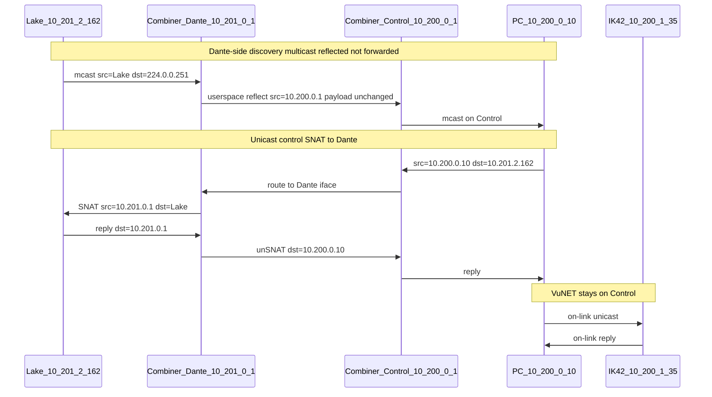

# Packet flow (production addressing)

How discovery and unicast control move through the combiner. Assumes a basic grasp of Linux forwarding, VLAN subinterfaces, and IPv4.

**Cabling, addresses, DHCP, install:** [`setup.md`](setup.md). Why: [`architecture.md`](architecture.md). Allow/deny: [`traffic-matrix.md`](traffic-matrix.md). Vendor notes: [`protocols.md`](protocols.md).

Walkthroughs below use the example hosts from `config/site.example.yaml` (`/21` audio nets): Control combiner `10.200.0.1`, Dante combiner `10.201.0.1`, PC `10.200.0.10`, IK42 `10.200.1.35`, Lake `10.201.2.162`. If your site uses other combiner IPs, substitute them.

Interface names below are written `eth0.C` / `eth0.D` because tagging is a per-site choice. On the default **audio trunk** profile Dante is the port's untagged/PVID VLAN, so `eth0.D` is really `eth0` and only Control gets a `.200` subinterface; on a fully tagged trunk they are `eth0.200` and `eth0.201`. Nothing in the packet path changes — every rule keys on interface *name*, not on whether the frame carried a tag.

```text
Martin Control 10.200.0.0/21                 Dante Primary 10.201.0.0/21
┌──────────────────────────────┐            ┌──────────────────────────────┐
│ PC 10.200.0.10               │            │ Lake LM44 10.201.2.162       │
│   VuNET + Dante Ctrl + WWB   │  L3 SNAT   │ Combiner eth0.D 10.201.0.1   │
│ IK42 10.200.1.35             │◄──────────►│                              │
│ Combiner eth0.C 10.200.0.1   │            └──────────────────────────────┘
└──────────────────────────────┘
```

On the Pi: one physical NIC, Control + Dante VLAN subinterfaces, `ip_forward=1`, nftables table `inet combiner`, and the userspace **reflector** joined to allowlisted multicast groups on both faces.

**Critical split**

| Kind | Path | Transform |
| --- | --- | --- |
| Multicast discovery (Dante/Shure/Lake) | **INPUT** on one VLAN → reflector → **OUTPUT** on the other | New UDP datagram; payload copied; headers rewritten |
| Unicast to Dante/Lake/Shure | Kernel **FORWARD** Control→Dante + **SNAT** | Conntrack; src becomes combiner Dante IP |
| Unicast VuNET / StageMix / MixPad | Local to Control (switch L2) | None |
| PTP / media → Control | **Dropped** | Protects Martin amp control stacks |

Kernel `forward` **never** passes `224.0.0.0/4` or `255.255.255.255`. If multicast shows up in `drop_forward_mcast`, that is working as designed.

---

## Part 1 — Device discovery (multicast)

Dante-style discovery is the concrete example (mDNS `224.0.0.251:5353` and/or Dante control `224.0.0.230–233:8700–8708`). Shure Discovery (`239.255.254.253:8427`) uses the same path. Lake uses the same *shape* once groups are allowlisted.

### 1a. Lake (or Shure) announces on Dante

**Intent:** the PC on Control must hear Dante-side discovery.

```text
Lake 10.201.2.162
  │  UDP multicast
  │  src 10.201.2.162
  │  dst 224.0.0.251:5353          (example)
  │  L2: mcast MAC, Dante VLAN tag
  ▼
Switch (Dante flood / IGMP)
  ▼
Combiner eth0.D   ← INPUT (not FORWARD)
  │  nftables: UDP to 224/4 allowed after PTP/media input denies
  │  Reflector socket joined 224.0.0.251 on eth0.D
  │
  │  Userspace reflector:
  │    - cm.Dst = 224.0.0.251, ingress = eth0.D
  │    - inventory: 10.201.2.162 on vlan=dante
  │    - builds a NEW UDP datagram (does not “route” the old one)
  │    - egress iface = eth0.C (Control)
  │    - TTL: 255 for mDNS; 1 for 224.0.0.0/24; else 32
  │    - src IP = 10.200.0.1 (combiner on Control)
  │    - src port = reflector listen port
  │    - dst still 224.0.0.251:5353
  │    - payload UNCHANGED (records inside still say 10.201.2.162)
  ▼
Control VLAN → PC 10.200.0.10
```

**Header mangling**

| Field | On Dante (original) | On Control (after reflect) |
| --- | --- | --- |
| VLAN | Dante | Control |
| Src MAC | Lake / switch | Combiner Control MAC |
| Src IP | `10.201.2.162` | **`10.200.0.1`** |
| Src UDP port | Lake’s | Reflector bound port |
| Dst IP:port | `224.0.0.251:5353` | same |
| TTL | as sent | forced per-group policy |
| Payload | device identity | **byte-identical** |

Dante Controller / WWB learn the device address from the **payload**, not from the outer source IP.

### 1b. PC multicast toward Dante

```text
PC 10.200.0.10 → dst 224.0.0.230:8700 (example)
  ▼
Combiner eth0.C (INPUT) → reflector → eth0.D
  new packet: src 10.201.0.1, dst 224.0.0.230:8700, payload same
  ▼
Lake / other Dante nodes
```

### 1c. VuNET / Yamaha / MixPad

No reflector. Discovery and unicast stay on Control. A&H MixPad **broadcast** find never crosses VLANs (nftables drops forwarded `255.255.255.255`).

### 1d. What never reaches Control

PTP (`224.0.1.129–132` UDP 319/320), Dante ATP / AES67 media ranges, etc. are dropped toward Control in nftables and refused by the reflector using `deny_multicast_prefixes` from `site.yaml`. Audio multicast stays on Dante. SoundGrid/SoE is not on this box.

---

## Part 2 — Unicast control (after discovery)

The PC’s default gateway is **`10.200.0.1`**. Apps unicast to real device IPs. On-link Control destinations (amps, consoles) never hit the combiner. Off-link Dante destinations do.

### 2a. PC → Lake LM44

**A. PC sends (Control)**

```text
src 10.200.0.10:54321
dst 10.201.2.162:8751     (example Dante metering port)
L2 dest = MAC of 10.200.0.1 (gateway ARP)
```

**B. Combiner routing**

Dest is not local → **FORWARD** `eth0.C` → `eth0.D`. Unicast accepted after PTP / multicast-forward drops.

**C. SNAT (postrouting)**

```text
Before:  10.200.0.10:54321 → 10.201.2.162:8751
After:   10.201.0.1:54321  → 10.201.2.162:8751
```

**D. On Dante** — Lake sees neighbor `10.201.0.1` and replies there. Conntrack un-SNATs back to `10.200.0.10`.

| Hop | Src | Dst |
| --- | --- | --- |
| Control, PC → combiner | `10.200.0.10` | `10.201.2.162` |
| Dante, combiner → Lake | **`10.201.0.1`** (SNAT) | `10.201.2.162` |
| Dante, Lake → combiner | `10.201.2.162` | `10.201.0.1` |
| Control, combiner → PC | `10.201.2.162` | `10.200.0.10` |

### 2b. PC → Martin IK42

Same subnet — switch L2 only. Combiner is not in the path.

```text
PC 10.200.0.10 → 10.200.1.35  (ARP for the amp, not the combiner)
```

### 2c. Both apps at once

```text
                 VuNET / MixPad  ──L2──► amps / consoles
PC 10.200.0.10 ─┤
                 Dante/Lake/WWB ──SNAT──► 10.201.0.1 ──► Dante VLAN
```

---

## Part 3 — Sequence (discovery then Dante unicast)



---

## Part 4 — Linux path cheat-sheet

| Traffic | Component | Transform |
| --- | --- | --- |
| Discovery mcast in | `input` on Control or Dante + reflector | `ReadFrom` |
| Discovery mcast out | Reflector `WriteTo` | New packet; src = combiner on egress; TTL policy; payload copy |
| Unicast PC → Dante device | `forward` + `postrouting` SNAT | Src → combiner Dante IP |
| Unicast device → PC | `forward` + conntrack un-SNAT | Dst restored to PC |
| Unicast PC → amp/console | L2 on Control | None |
| PTP/media → Control | Early `forward` drop | `drop_ptp` / `drop_deny_mcast` |
| Any mcast in `forward` | Drop | `drop_forward_mcast` |

**ARP is per-VLAN.** The PC ARPs for `10.200.0.1` only when the destination is off-subnet (Dante). Amps ARP for the PC directly. Dante devices ARP for the combiner’s Dante address, never for `10.200.0.10`.

---

## Part 5 — Why SNAT is required on Dante

Without SNAT, a forwarded packet would still carry `src=10.200.0.10` onto Dante. Gear with empty/wrong gateways will not reply off-subnet. SNAT makes Dante sessions look like:

> “I am talking to my neighbor `10.201.0.1`.”
